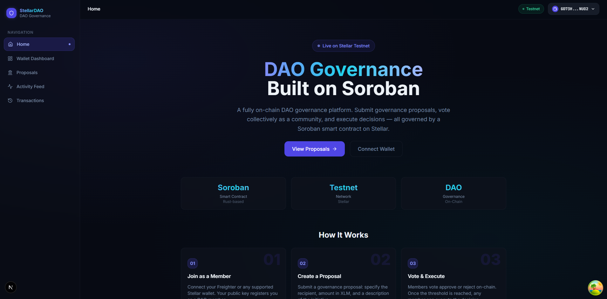
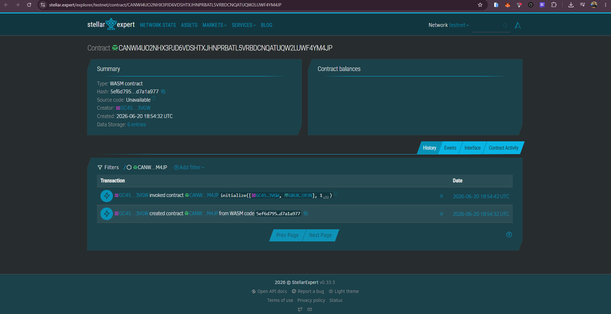
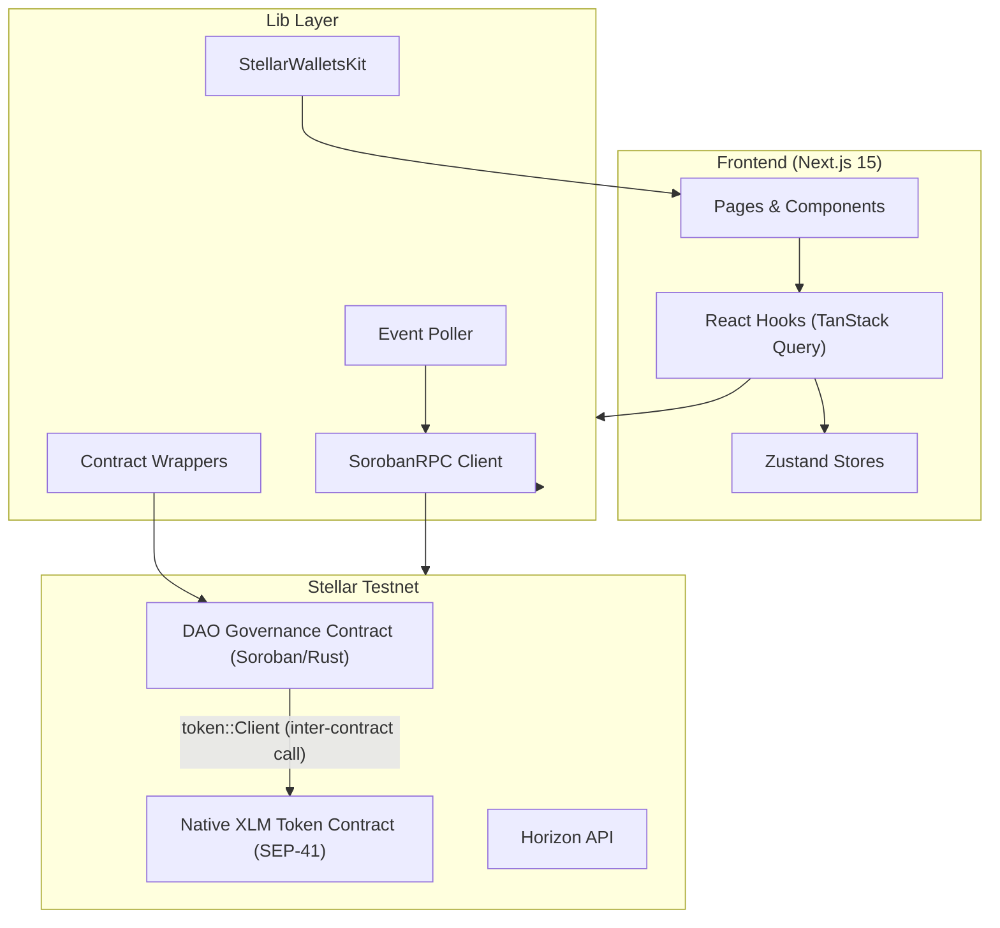

# 🏛️ Stellar DAO Governance Platform

<p align="center">
  
  
  
  
  
  
</p>

A **production-grade, on-chain DAO governance dApp** built on Stellar/Soroban. DAO members collectively govern a shared fund by submitting governance proposals, casting on-chain votes, executing approved decisions, and monitoring all ledger activity in real time.

---

## 📸 Screenshots

<p align="center">
  
  
</p>

---

## 🔗 Contract Explorer & Credentials

| Resource | Value / Link |
| :--- | :--- |
| **Contract ID** | `CAUD5JJ5S3GKLZJWUSTUMPP5DOU3KVK5F6QG5H7JQS4CNVCRGWHZX3YW` |
| **Stellar Expert Explorer** | [View Contract on Stellar Expert](https://stellar.expert/explorer/testnet/contract/CAUD5JJ5S3GKLZJWUSTUMPP5DOU3KVK5F6QG5H7JQS4CNVCRGWHZX3YW) |
| **Freighter Wallet Address** | `GD73H6YI3Z63WGVEVXC4NECRTNXZ6EPYIDUJIQHGWKK6IOAG5D7PNUO2` |
| **GitHub Repository** | [shuvamdutta2004/Stellar-DAO-Governance-Platform](https://github.com/shuvamdutta2004/Stellar-DAO-Governance-Platform) |
| **Live Deployment** | [stellar-dao-governance-platform.vercel.app](https://stellar-dao-governance-platform.vercel.app/) |
| **Demo Video** | [Watch Demo Video on Google Drive](https://drive.google.com/file/d/1dXPCNXjuHJQjdkOHtsf9zI62s_vdvJqj/view?usp=sharing) |

---

## ✨ Features

- **🏛️ DAO Governance** — Collective on-chain decision-making. Proposals only execute when N-of-M DAO members approve. No single point of compromise.
- **📜 Governance Proposals** — Any registered DAO member can propose: recipient address, XLM amount, and a description of the initiative.
- **🗳️ On-Chain Voting** — Each member votes once per proposal. A live progress bar shows real-time approval vs rejection towards the threshold.
- **⚡ Threshold Execution** — When approvals reach the governance threshold, any member can execute and trigger the on-chain transfer.
- **🔔 Real-Time Event Feed** — Soroban RPC `getEvents` polled every 5s. Governance events stream into the activity feed instantly.
- **💼 Multi-Wallet Support** — StellarWalletsKit: Freighter, xBull, ALBEDO, Lobstr, Rabet.
- **📱 Mobile Responsive** — Hamburger nav, responsive layouts for all screen sizes.
- **🧪 Tested** — Rust contract unit tests + Vitest frontend tests (utils, stores, components).
- **🔄 CI/CD** — GitHub Actions: lint + build + test on every PR; auto-deploy to Vercel on main.

---

## 🏗️ Architecture



---

## 📋 Smart Contract API Reference

The DAO governance contract (`contracts/treasury/src/lib.rs`) exposes the following public functions:

| Function | Parameters | Returns | Description |
|----------|-----------|---------|-------------|
| `initialize` | `signers: Vec<Address>`, `threshold: u32` | `()` | Set up DAO. Call once. Registers members and governance threshold. |
| `deposit` | `from: Address`, `token_address: Address`, `amount: i128` | `()` | Deposit XLM into the DAO fund. |
| `create_proposal` | `proposer: Address`, `recipient: Address`, `amount: i128`, `description: Symbol`, `token_address: Address` | `u32` | Submit a governance proposal, returns proposal ID. |
| `vote` | `voter: Address`, `proposal_id: u32`, `approve: bool` | `()` | Cast a vote. One vote per member per proposal. |
| `execute_proposal` | `executor: Address`, `proposal_id: u32`, `token_address: Address` | `()` | Execute approved proposal (triggers on-chain transfer). |
| `cancel_proposal` | `proposer: Address`, `proposal_id: u32` | `()` | Cancel pending proposal. Proposer only. |
| `get_proposal` | `proposal_id: u32` | `Proposal` | Fetch single proposal by ID. |
| `get_proposals` | — | `Vec<Proposal>` | Fetch all proposals. |
| `get_signers` | — | `Vec<Address>` | List all registered DAO members. |
| `get_balance` | — | `i128` | Current DAO fund balance (stroops). |
| `get_threshold` | — | `u32` | Required approval count for execution. |
| `get_proposal_count` | — | `u32` | Total number of proposals submitted. |
| `is_signer` | `addr: Address` | `bool` | Check if an address is a registered DAO member. |
| `has_voted` | `voter: Address`, `proposal_id: u32` | `bool` | Check if a member already voted on a proposal. |

### Contract Events

| Event | Topics | Data | Emitted When |
|-------|--------|------|--------------| 
| `dao_initialized` | — | `(threshold, member_count)` | DAO initialized |
| `funds_received` | `from` | `amount` | XLM deposited into DAO fund |
| `proposal_created` | `proposer` | `(proposal_id, amount)` | New governance proposal submitted |
| `vote_cast` | `voter` | `(proposal_id, approve)` | Vote submitted by a member |
| `proposal_approved` | — | `proposal_id` | Approval threshold reached |
| `proposal_rejected` | — | `proposal_id` | Rejection is mathematically certain |
| `proposal_executed` | `executor` | `(proposal_id, amount)` | Governance decision executed on-chain |

### Inter-Contract Communication

The DAO governance contract uses **`soroban_sdk::token::Client`** (SEP-41 standard) to call the native XLM token contract directly on-chain for both deposits and proposal executions — a true inter-contract call pattern on Soroban.

---

## ⚙️ Tech Stack & Architecture

| Layer | Technology |
|-------|-----------|
| Framework | Next.js 15 (App Router) |
| Language | TypeScript (strict) |
| Styling | Tailwind CSS v3 + custom dark glassmorphism |
| State | Zustand (wallet, transactions, events) |
| Data Fetching | TanStack Query v5 (React Query) |
| Wallet | `@creit.tech/stellar-wallets-kit` |
| Blockchain SDK | `@stellar/stellar-sdk` |
| Smart Contract | Soroban (Rust) — `wasm32v1-none` |
| Testing (Frontend) | Vitest + React Testing Library |
| Testing (Contract) | Soroban SDK testutils (`cargo test`) |
| CI/CD | GitHub Actions → Vercel |

---

## 📂 Project Structure

```text
.
├── .github/workflows/
│   ├── ci.yml              # Lint + Build + Test on every PR
│   └── deploy.yml          # Auto-deploy to Vercel on main
├── app/
│   ├── layout.tsx          # Root layout, providers, metadata
│   ├── page.tsx            # Landing page with DAO feature cards
│   ├── dashboard/          # Wallet details & connection console
│   ├── treasury/           # Proposals, create proposal, vote, execute
│   ├── activity/           # Real-time governance event feed
│   └── transactions/       # Transaction history logs
├── components/
│   ├── layout/             # Navbar (mobile hamburger) & Sidebar
│   ├── wallet/             # Connection state, AddressDisplay
│   ├── treasury/           # ProposalCard, CreateProposalForm, VotingProgress
│   └── activity/           # EventFeed, EventItem
├── contracts/
│   └── treasury/           # Rust Soroban DAO smart contract
│       └── src/
│           ├── lib.rs      # Contract logic + unit tests
│           └── types.rs    # Proposal, VoteRecord, DataKey types
├── hooks/                  # React Query mutations & polling hooks
├── lib/
│   ├── stellar/            # RPC client, contract wrappers, wallet, events
│   └── utils.ts            # Formatting helpers
├── scripts/
│   ├── deploy.ts           # Full contract deployment script
│   └── initialize-contract.ts
├── src/__tests__/          # Frontend tests (Vitest + RTL)
│   ├── utils.test.ts
│   ├── walletStore.test.ts
│   ├── transactionStore.test.ts
│   ├── VotingProgress.test.tsx
│   └── AddressDisplay.test.tsx
└── store/                  # Zustand global state containers
```

---

## 🚀 Setup & Local Execution

### Prerequisites
- Node.js v18+
- Freighter browser extension (set to Testnet)
- Rust + Stellar CLI (only if re-deploying the contract)

### 1. Install Dependencies
```bash
npm install
```

### 2. Configure Environment Variables
Create `.env.local` at the root:
```env
NEXT_PUBLIC_STELLAR_NETWORK=testnet
NEXT_PUBLIC_STELLAR_RPC_URL=https://soroban-testnet.stellar.org
NEXT_PUBLIC_NETWORK_PASSPHRASE="Test SDF Network ; September 2015"
NEXT_PUBLIC_TREASURY_CONTRACT_ID=CAUD5JJ5S3GKLZJWUSTUMPP5DOU3KVK5F6QG5H7JQS4CNVCRGWHZX3YW
NEXT_PUBLIC_HORIZON_URL=https://horizon-testnet.stellar.org
NEXT_PUBLIC_NATIVE_TOKEN_ADDRESS=CDLZFC3SYJYDZT7K67VZ75HPJVIEUVNIXF47ZG2FB2RMQQVU2HHGCYSC
```

### 3. Run Development Server
```bash
npm run dev
```
Open [http://localhost:3000](http://localhost:3000).

### 4. Build for Production
```bash
npm run build
npm run start
```

---

## 🧪 Running Tests

### Frontend Tests (Vitest)
```bash
# Run all tests once
npm run test

# Watch mode (re-runs on file change)
npm run test:watch

# With coverage report
npm run test:coverage
```

### Smart Contract Tests (Rust)
```bash
# Run from the workspace root
cargo test --manifest-path contracts/treasury/Cargo.toml
```

### Build the Contract WASM
```bash
# Using Stellar CLI (from workspace root)
stellar contract build

# Or using Cargo directly
cargo build --manifest-path contracts/treasury/Cargo.toml \
  --target wasm32-unknown-unknown --release
```

---

## 🔄 CI/CD Pipeline

Two GitHub Actions workflows are included:

| Workflow | Trigger | Jobs |
|----------|---------|------|
| `ci.yml` | Every push & PR | ESLint → Vitest → Next.js build → Rust `cargo test` → WASM build |
| `deploy.yml` | Push to `main` | Vercel production deployment |

---

## 🔄 Core User Flow

1. **Connect Wallet** — Authenticate with Freighter (or any StellarWalletsKit-supported wallet).
2. **Submit Proposal** — Navigate to **Proposals** → fill out the Governance Proposal form.
3. **Vote** — Registered DAO members review Active Proposals and click Approve or Reject.
4. **Execute** — Once the governance threshold is met, any member clicks **Execute** to submit the decision on-chain.
5. **Monitor** — Watch incoming governance events and transaction status in the **Activity Feed**.

---

## 🛡️ Security & Production Practices

- **`require_auth()`** on every mutating contract function — prevents unauthorized calls
- **One vote per member** enforced on-chain via `VoterVoted(proposal_id, voter)` storage key
- **Double-initialization guard** — `Initialized` key checked before DAO setup
- **Insufficient balance checks** before both proposal creation and execution
- **Environment variables** for all network config — no hardcoded secrets
- **TypeScript strict mode** — catches type errors at compile time
- **Error boundaries** — wallet errors parsed and shown as toast notifications
